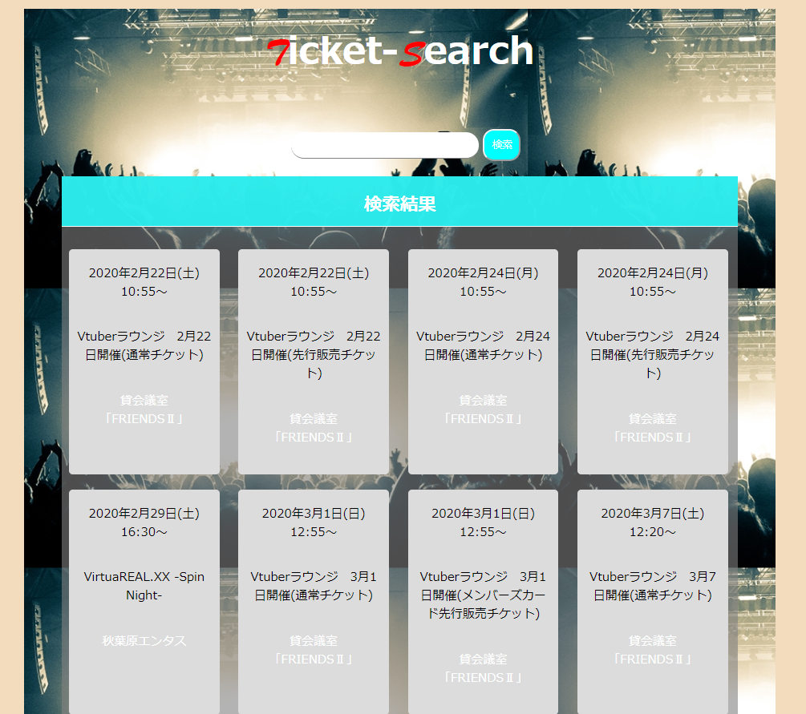

# ticket-search

## どんなアプリ？
   
 検索バーに入力すると  
 複数のチケットサイトから  
 入力したキーワードに関するイベントをスクレイピングするWebアプリです。  
 
## 使い方
　検索バーに気になるアーティストを入れて検索するとそのアーティストの  
  イベント情報をまとめてきます  

## なぜ作ったか
趣味のライブ観戦でチケットを探す時、一つのサイトだけでなく、複数のサイトに情報が載っているときがありました。そのため、一回でまとめて情報を集められないかなと考え作成しました。

## どう解決したか
requestライブラリを使ってページ情報を取得し、beautifulsoupを使って必要な情報をまとめ、複数のライブ情報を集めました。
